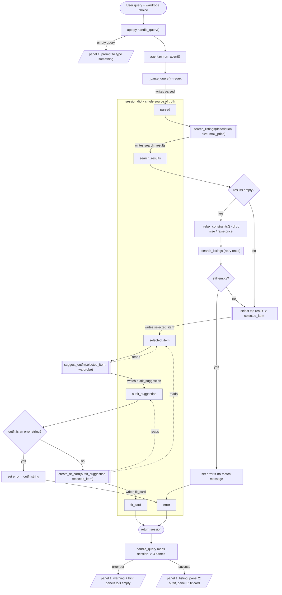

# FitFindr — planning.md

> Complete this document before writing any implementation code.
> Your spec and agent diagram are what you'll use to direct AI tools (Claude, Copilot, etc.) to generate your implementation — the more specific they are, the more useful the generated code will be.
> Your planning.md will be reviewed as part of your submission.
> Update it before starting any stretch features.

---

## Tools

List every tool your agent will use. For each tool, fill in all four fields.
You must have at least 3 tools. The three required tools are listed — add any additional tools below them.

### Tool 1: search_listings

**What it does:**
Searches the 40-item mock listings dataset for secondhand pieces that match the
user's keywords, and (optionally) filters those matches by size and by a maximum
price. It ranks the survivors by how well their text matches the keywords and
returns the best matches first.

**Input parameters:**
- `description` (str): free-text keywords describing the item the user wants,
  e.g. `"vintage graphic tee"`. Required. Tokenized and matched against each
  listing's title, description, style_tags, category, brand, and colors.
- `size` (str | None): a size string to filter by, e.g. `"M"`. Optional —
  pass `None` to skip size filtering. Matching is case-insensitive and
  substring-based, so `"M"` matches a listing sized `"S/M"`.
- `max_price` (float | None): inclusive price ceiling in dollars, e.g. `30.0`.
  Optional — pass `None` to skip price filtering.

**What it returns:**
`list[dict]` — a list of matching listing dicts, sorted by keyword-match score
(highest first). Each dict has: `id` (str), `title` (str), `description` (str),
`category` (str), `style_tags` (list[str]), `size` (str), `condition` (str),
`price` (float), `colors` (list[str]), `brand` (str | None), `platform` (str).
Returns `[]` (empty list) when nothing matches — never raises.

**What happens if it fails or returns nothing:**
Returns an empty list rather than raising. The planning loop treats an empty
list as a stop condition: it does NOT call `suggest_outfit`, and instead ends
the interaction early with an actionable message telling the user which
constraints (keywords / size / price) were applied and suggesting they loosen
one (raise `max_price`, drop the size, or use broader keywords).

---

### Tool 2: suggest_outfit

**What it does:**
Takes the thrifted item the user is considering plus the user's existing
wardrobe and asks the LLM (Groq `openai/gpt-oss-120b` — the handout's
`meta-llama/llama-4-scout-17b-16e-instruct` is no longer served by Groq)
to propose 1–2 complete, wearable outfits. When the wardrobe is empty it
switches to giving general styling advice for the item instead.

**Input parameters:**
- `new_item` (dict): a single listing dict from `search_listings` — the item
  being styled. Its `title`, `category`, `style_tags`, `colors`, and `condition`
  are formatted into the prompt.
- `wardrobe` (dict): a wardrobe dict with an `"items"` key holding a list of
  wardrobe-item dicts (`name`, `category`, `colors`, `style_tags`, `notes`).
  May be `{"items": []}` — handled as the empty-wardrobe case.

**What it returns:**
`str` — a non-empty, human-readable string. With a populated wardrobe it names
1–2 outfits that pair `new_item` with specific pieces from the wardrobe (by
name). With an empty wardrobe it returns general styling guidance (what
categories/colors/silhouettes pair well, what vibe it suits). On an LLM/network
failure it returns a plain-text error string beginning with `"[suggest_outfit
error]"` — it never raises.

**What happens if it fails or returns nothing:**
- Empty wardrobe → general styling advice branch (still a useful non-empty
  string; the agent continues to `create_fit_card`).
- LLM call raises (bad key, network, rate limit) → caught; returns
  `"[suggest_outfit error] ..."`. The planning loop detects the `[...]` error
  prefix and stops before `create_fit_card`, surfacing the message to the user.

---

### Tool 3: create_fit_card

**What it does:**
Turns the outfit suggestion plus the item details into a short, casual,
shareable caption (an OOTD / "fit card" post). Calls the LLM at a higher
temperature so repeated calls on the same input produce varied captions.

**Input parameters:**
- `outfit` (str): the outfit-suggestion string returned by `suggest_outfit`.
  Required and must be non-empty/non-whitespace — this is the guarded failure
  mode.
- `new_item` (dict): the listing dict for the thrifted item. Its `title`,
  `price`, and `platform` are woven into the caption once each.

**What it returns:**
`str` — a 2–4 sentence caption written to sound like a real person's post, that
mentions the item name, price, and platform naturally and captures the outfit
vibe. On an LLM/network failure it returns `"[create_fit_card error] ..."`.
It never raises.

**What happens if it fails or returns nothing:**
- `outfit` empty / whitespace-only / not a string → returns the descriptive
  string `"[create_fit_card error] No outfit was provided, so there's nothing
  to write a caption about. Run suggest_outfit first."` (no LLM call made).
- LLM call raises → caught; returns `"[create_fit_card error] ..."` naming the
  underlying problem so the agent can tell the user the caption step failed but
  the listing and outfit are still valid.

---

### Additional Tools (if any)

<!-- Copy the block above for any tools beyond the required three -->

---

## Planning Loop

**How does your agent decide which tool to call next?**

The loop lives in `run_agent(query, wardrobe)` in `agent.py`. It is **not** a
fixed "call all three tools" pipeline — after each step it inspects the session
state and branches:

1. **Parse.** `_parse_query()` runs regex over the raw query to pull out
   `size` (`\bsize\s+(\S+)\b`), `max_price` (`under/below/less than/$N`), and a
   cleaned `description` (query minus those clauses minus conversational
   filler). Regex was chosen over an LLM parse so it is deterministic, free,
   and unit-testable. Result stored in `session["parsed"]`.

2. **search_listings** always runs, with the parsed params. Result →
   `session["search_results"]`.

3. **Branch on the result count:**
   - **`len(search_results) == 0`** → the loop calls `_relax_constraints()`,
     which loosens the single most restrictive optional filter (drop `size`
     first; else raise `max_price` by 1.5×) and retries `search_listings`
     **once**. `session["retried_search"]` and `session["relaxed_constraint"]`
     record this.
     - Still `0` after the retry → set `session["error"]` to an actionable
       message and **return immediately**. `suggest_outfit` and
       `create_fit_card` are never called; `selected_item`, `outfit_suggestion`,
       and `fit_card` stay `None`.
   - **`len(search_results) >= 1`** → continue.

4. **Select** `search_results[0]` (highest keyword score) →
   `session["selected_item"]`.

5. **suggest_outfit** runs with `selected_item` + `wardrobe`. The tool itself
   branches internally on `wardrobe["items"]` being empty (general advice) vs
   populated (named-piece combos). Result → `session["outfit_suggestion"]`.

6. **Branch on the outfit string:**
   - starts with `"[suggest_outfit error]"` → set `session["error"]` to that
     string and **return**. `create_fit_card` is never called.
   - otherwise → continue.

7. **create_fit_card** runs with `outfit_suggestion` + `selected_item`. Result
   → `session["fit_card"]`. A `"[create_fit_card error]"` result is **non-fatal**
   — it is stored and shown, but `session["error"]` stays `None` because the
   listing and outfit are still valid output.

8. **Done** — return the session. The loop is single-pass; "done" = it either
   hit an early-return branch or completed step 7. There is no re-planning
   cycle because the task is a fixed 3-stage funnel (find → style → caption);
   the adaptiveness is in *which* stages run, not in reordering them.

**Different inputs → different tool sequences:**

| Input | search | retry | suggest_outfit | create_fit_card |
|-------|:---:|:---:|:---:|:---:|
| "vintage graphic tee under $30" (happy path) | ✓ (20 hits) | – | ✓ | ✓ |
| "designer ballgown size XXS under $5" (no match) | ✓ (0) | ✓ (0) | ✗ | ✗ |
| "combat boots size 99" (bad size) | ✓ (0) | ✓ drops size | ✓ | ✓ |
| happy path but Groq is down | ✓ | – | ✓ → error string | ✗ |

---

## State Management

**How does information from one tool get passed to the next?**

A single **session dict**, created by `_new_session()` at the top of
`run_agent()`, is the one source of truth for the interaction. Nothing is
stored in globals; the user is asked for input exactly once (the `query`
argument) and never re-prompted between steps.

**What is stored, and when:**

| Key | Written by | Read by |
|-----|-----------|---------|
| `query` | `_new_session` (step 1) | parser |
| `parsed` = `{description, size, max_price}` | step 2 | `search_listings` call |
| `search_results` (list[dict]) | step 3 (+ retry) | branch check, step 4 |
| `selected_item` (dict) | step 4 | `suggest_outfit` **and** `create_fit_card` |
| `wardrobe` (dict) | `_new_session` | `suggest_outfit` |
| `outfit_suggestion` (str) | step 5 | branch check, `create_fit_card` |
| `fit_card` (str) | step 7 | UI |
| `error` (str \| None) | any early-return branch | UI (checked first) |
| `steps` (list[str]) | every step | debugging / demo narration |
| `retried_search`, `relaxed_constraint` | step 3b | UI note |

**How it flows without re-entry:** `search_listings` returns a list; the loop
assigns `session["selected_item"] = results[0]` and then passes
*that same dict object* into `suggest_outfit(session["selected_item"], ...)` and
later into `create_fit_card(..., session["selected_item"])`. Verified with an
`id()` check: the object id of `session["selected_item"]` is identical to the
id of the argument received by both downstream tools. Likewise the exact string
`suggest_outfit` returns is what `create_fit_card` receives —
`session["outfit_suggestion"]` is passed by reference, not rebuilt.

---

## Error Handling

For each tool, describe the specific failure mode you're handling and what the agent does in response.

| Tool | Failure mode | Agent response |
|------|-------------|----------------|
| search_listings | No results match the query (keywords/size/price too narrow) | Tool returns `[]`. Agent stops the loop before `suggest_outfit`, and returns a message naming the applied filters and suggesting the user loosen one (raise price, drop size, broaden keywords). |
| suggest_outfit | Wardrobe is empty (`wardrobe["items"] == []`) | Not an error — tool switches to a general-styling-advice prompt and still returns a useful non-empty string. Agent continues to `create_fit_card`. |
| suggest_outfit | LLM call fails (bad/missing API key, network, rate limit) | Tool catches the exception and returns `"[suggest_outfit error] ..."`. Agent detects the `[...]` prefix, stops before `create_fit_card`, and tells the user the styling step failed and to retry. |
| create_fit_card | Outfit input missing / empty / whitespace-only | Tool makes no LLM call and returns `"[create_fit_card error] No outfit was provided..."`. Agent surfaces this; the listing and outfit (if any) are still shown. |
| create_fit_card | LLM call fails | Tool catches and returns `"[create_fit_card error] ..."`. Agent shows the listing + outfit and notes the caption couldn't be generated. |

---

## Architecture

<!-- Draw a diagram of your agent showing how the components connect:
     User input → Planning Loop → Tools (search_listings, suggest_outfit, create_fit_card)
                                                                          ↕
                                                                   State / Session
     Show what triggers each tool, how state flows between them, and where error paths branch off.
     Use ASCII art or a Mermaid diagram (https://mermaid.js.org/syntax/flowchart.html).
     Do NOT embed an image — graders need to read your diagram directly in the file;
     an embedded image or screenshot cannot be evaluated.
     You'll share this diagram with an AI tool when asking it to implement
     the planning loop and each individual tool. -->

Control flow = solid arrows (top to bottom). State writes/reads = labelled
arrows into/out of the session dict. Error paths branch off at `D1/D2` (no
listings) and `D3` (styling failed) and short-circuit straight to
`return session` — the tools further down the funnel are skipped.

---

## AI Tool Plan

<!-- For each part of the implementation below, describe:
     - Which AI tool you plan to use (Claude, Copilot, ChatGPT, etc.)
     - What you'll give it as input (which sections of this planning.md, your agent diagram)
     - What you expect it to produce
     - How you'll verify the output matches your spec before moving on

     "I'll use AI to help me code" is not a plan.
     "I'll give Claude my Tool 1 spec (inputs, return value, failure mode) and ask it to implement
     search_listings() using load_listings() from the data loader — then test it against 3 queries
     before trusting it" is a plan. -->

**Milestone 3 — Individual tool implementations:**
Tool used: Claude (Claude Code). For each of the three tools I pasted that
tool's spec block from the "Tools" section above (what it does, input parameter
names + types, return value, failure mode) and asked for an implementation in
`tools.py` — one tool per prompt, not all at once.
- `search_listings`: directed it to use `load_listings()` from
  `utils/data_loader.py` (not re-read the file), filter by `max_price` and
  `size` first, then score by keyword overlap, drop score-0 rows, sort
  descending. Verified against 3 queries: a normal query returns results, an
  over-constrained query returns `[]`, and a `max_price` query returns only
  items at/under the ceiling.
- `suggest_outfit`: directed it to branch on `wardrobe["items"]` being empty,
  call the Groq LLM, and wrap the call in try/except returning a
  `"[suggest_outfit error] ..."` string. Verified the empty-wardrobe branch
  returns advice without crashing. Divergence found while testing: the handout's
  model `meta-llama/llama-4-scout-17b-16e-instruct` returns 404 from Groq, so
  both LLM tools use `openai/gpt-oss-120b` (a current Groq chat model) instead.
- `create_fit_card`: directed it to guard an empty/whitespace `outfit` string
  before any LLM call, and to use a higher temperature so captions vary.
  Verified by calling it twice on the same input and confirming the outputs
  differ, and by passing `""` and confirming an error string (no exception).
Every generated function was checked against its spec block for matching
parameter names/types and failure-mode handling before being run, then locked
in with the pytest tests in `tests/test_tools.py`.

**Milestone 4 — Planning loop and state management:**
Tool used: Claude (Claude Code). Input given: the full Planning Loop section
above (the numbered branch logic + the "different inputs → different sequences"
table), the State Management table, and the Mermaid architecture diagram, plus
the `agent.py` TODO comments. Asked it to implement `run_agent()` matching that
spec and `handle_query()` in `app.py`.
Expected output: a single-pass loop that (a) parses with regex into
`session["parsed"]`, (b) calls `search_listings`, (c) branches on the result
count — one relaxed retry then early-return-with-error if still empty, never
calling the LLM tools, (d) passes `session["selected_item"]` by reference into
both `suggest_outfit` and `create_fit_card`, (e) early-returns if
`suggest_outfit` returns an error string.
Verification before trusting it:
- `python agent.py` — happy path calls all 3 tools; no-results path leaves
  `error` set and `outfit_suggestion` / `fit_card` `None`.
- `id()` check — `session["selected_item"]` is the *same object* passed into
  both downstream tools (no re-entry, no hardcoded values).
- `tests/test_agent.py` — 9 tests: monkeypatch the LLM tools to record calls and
  assert the loop skips them on the no-results and LLM-failure branches, and
  that state identity holds on the happy path. These run without an API key.

---

## A Complete Interaction (Step by Step)

Write out what a full user interaction looks like from start to finish — tool call by tool call. Use a specific example query.

**Example user query:** "I'm looking for a vintage graphic tee under $30. I mostly wear baggy jeans and chunky sneakers. What's out there and how would I style it?"

**Step 0 — parse.** `_parse_query()` extracts:
`{description: "a vintage graphic tee baggy jeans and chunky sneakers",
size: None, max_price: 30.0}` — it caught "under $30", found no "size …"
clause, and stripped the filler ("I'm looking for", "how would I style it").
Stored in `session["parsed"]`.

**Step 1 — `search_listings("a vintage graphic tee baggy jeans and chunky
sneakers", None, 30.0)`.**
Why this tool: we can't style or caption anything until we have a real listing.
Filters out everything over $30, scores the rest on keyword overlap.
Returns **21** listing dicts, best match first. Stored in
`session["search_results"]`. Count > 0 → no retry, continue.

**Step 2 — select.** `session["selected_item"] = search_results[0]` =
*Vintage Band Tee — Faded Grey*, $19, size L, depop. This exact dict is what
every later step uses — the user is not asked to pick.

**Step 3 — `suggest_outfit(session["selected_item"], wardrobe)`.**
Why this tool: the user asked "how would I style it", and we now have an item +
their 10-piece wardrobe. The tool sees a non-empty wardrobe so it builds
concrete combinations. Returns a string naming 2 outfits:
> **1. "Grunge-Rock Remix"** – Vintage Band Tee + Baggy straight-leg jeans,
> dark wash + Black combat boots + Vintage black denim jacket + Brown leather
> belt + Black crossbody bag …
> **2. "Minimalist Street-Vibe"** – Vintage Band Tee + Wide-leg khaki trousers
> + Black cropped zip hoodie + Chunky white sneakers …

Stored in `session["outfit_suggestion"]`. Does not start with
`"[suggest_outfit error]"` → continue.

**Step 4 — `create_fit_card(session["outfit_suggestion"],
session["selected_item"])`.**
Why this tool: turn the styled look into something shareable. Gets the outfit
string from step 3 and the same item dict from step 2 — nothing re-entered.
Returns:
> Scored this Vintage Band Tee — Faded Grey for $19 on depop and teamed it with
> baggy straight-leg jeans, a black denim jacket and combat boots for a solid
> grunge-rock remix vibe. The oversized denim keeps the silhouette loose, while
> the belt and black crossbody add just the right amount of rugged edge.
> #grunge #secondhandstyle

Stored in `session["fit_card"]`. `session["error"]` is still `None`.

**Final output to user (three Gradio panels):**
- **🛍️ Top listing found:** "Vintage Band Tee — Faded Grey / $19 · fair
  condition · depop / Size L · tops / Style: vintage, band tee, … / Colors:
  grey, black / <description>"
- **👗 Outfit idea:** the two named outfits from step 3.
- **✨ Your fit card:** the caption from step 4.

**Contrast — the no-results branch:** for "designer ballgown size XXS under $5",
step 1 returns `[]`, the loop retries once after dropping the size filter, still
gets `[]`, sets `session["error"]` = *"No listings matched \"designer
ballgown\" (size XXS, under $5). Try broader keywords, a wider size, or a higher
price ceiling."* and returns. `suggest_outfit` and `create_fit_card` are never
called; the UI shows the warning in panel 1 and leaves panels 2–3 empty.
